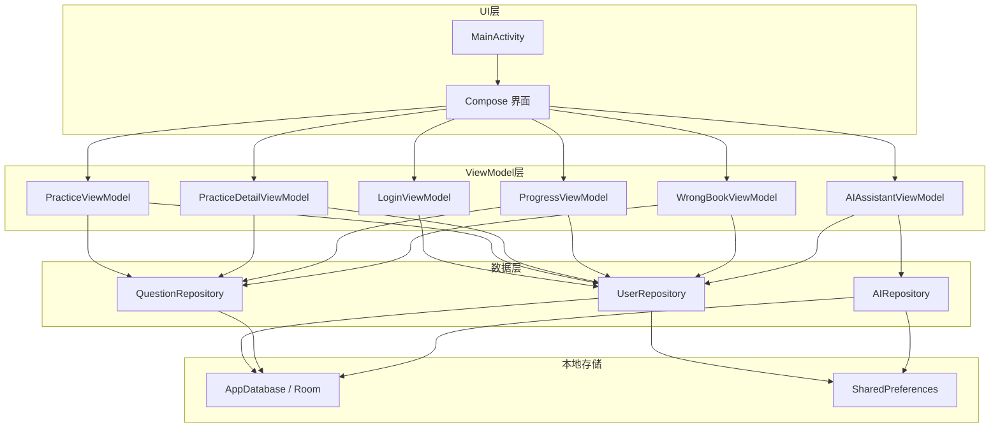
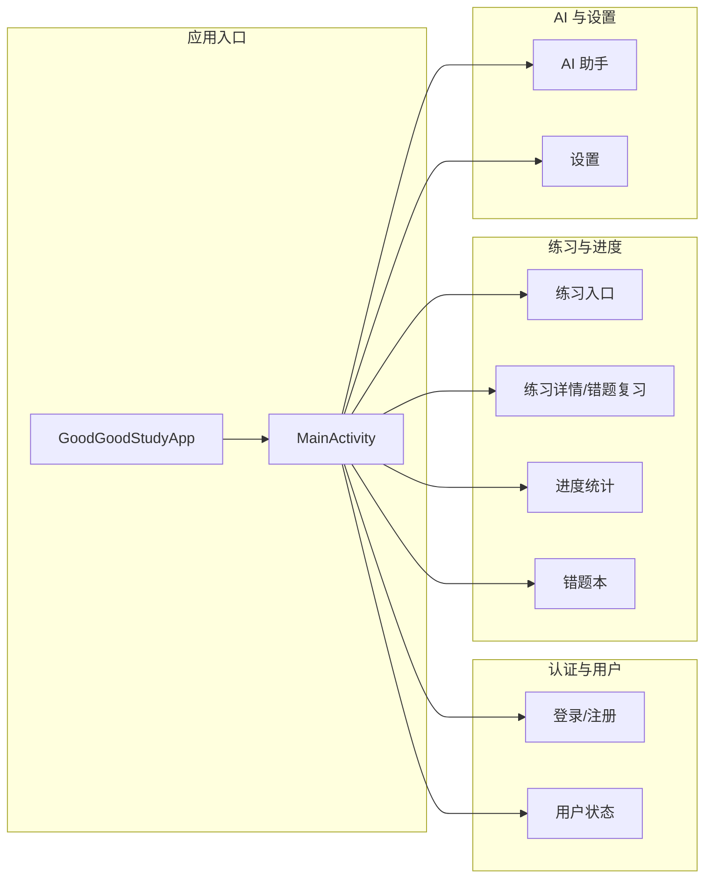
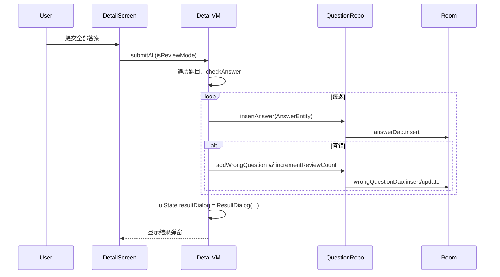

# GoodGoodStudy 架构说明

## 1. 概述

GoodGoodStudy 是一款小学课后练习 Android 应用，采用 **单 Activity + Jetpack Compose + MVVM** 架构，数据持久化使用 Room，导航使用 Navigation Compose，状态以 StateFlow 驱动 UI。

## 2. 整体架构图



## 3. 层级与依赖

| 层级 | 职责 | 主要组件 |
|------|------|----------|
| UI | 单一 Activity、Compose 界面、导航 | MainActivity, *Screen Composables, NavHost |
| ViewModel | 界面状态、调用 Repository、协程 | *ViewModel, ViewModelFactory |
| Repository | 数据聚合、IO 调度、业务规则 | UserRepository, QuestionRepository, AIRepository |
| Local | 持久化与类型转换 | AppDatabase, DAO, Entity, StringListConverter |
| Util / AI | 工具与规则 AI | AppConstants, InputValidator, RuleBasedTextGenerator, QuestionDataGenerator, DatabaseInitializer |

依赖方向：UI → ViewModel → Repository → Local/Util；ViewModel 通过 ViewModelFactory 从 Application 获取 Repository。

## 4. 功能模块划分



- **应用入口**：GoodGoodStudyApp 提供 Repository 单例；MainActivity 根据登录状态决定起始路由并注册所有 Compose 路由。
- **认证与用户**：登录/注册界面，UserRepository 管理当前用户 ID（StateFlow）与 SharedPreferences。
- **练习与进度**：练习入口（学科/年级）→ 练习详情（做题、提交、错题记录）→ 错题本 → 错题复习；进度页展示答题统计。
- **AI 与设置**：AI 助手使用 AIRepository（规则回退，可扩展 TFLite）；设置页可扩展 API Key 等。

## 5. 核心数据流示例

### 5.1 登录成功到主界面

```mermaid
sequenceDiagram
    participant User
    participant LoginScreen
    participant LoginVM
    participant UserRepo
    participant Prefs
    participant Room

    User->>LoginScreen: 输入账号密码并点击登录
    LoginScreen->>LoginVM: login(username, password)
    LoginVM->>UserRepo: login(username, password)
    UserRepo->>Room: userDao.getByUsername
    Room-->>UserRepo: UserEntity
    UserRepo->>UserRepo: PasswordUtil.verify
    UserRepo->>Prefs: 保存 userId, username
    UserRepo->>UserRepo: _currentUserId.value = userId
    UserRepo-->>LoginVM: Result.success(user)
    LoginVM->>LoginVM: uiState.loginSuccess = true
    LoginScreen->>MainActivity: onLoginSuccess()
    MainActivity->>MainActivity: navigate(MAIN); popUpTo(LOGIN)
```

### 5.2 练习提交与错题记录



## 6. 关键设计说明

- **单 Activity**：所有界面由 MainActivity 内的 NavHost 管理，通过 NavRoutes 常量与路径函数统一路由。
- **依赖注入**：ViewModel 不直接 new Repository，而是通过 ViewModelFactory 从 GoodGoodStudyApp 获取，便于测试与替换。
- **状态与线程**：Repository 内 IO 统一在 `Dispatchers.IO` 上执行；ViewModel 使用 `viewModelScope.launch` 与 `StateFlow` 更新 UI 状态。
- **AI 扩展**：AIRepository 当前使用 RuleBasedTextGenerator；接口设计可扩展为优先 TFLite、失败时规则回退（参考 aiAssistant 项目）。

更多模块与类关系见各模块文档：  
[module-app.md](modules/module-app.md) | [module-data.md](modules/module-data.md) | [module-ui-learning.md](modules/module-ui-learning.md) | [module-ai.md](modules/module-ai.md)
