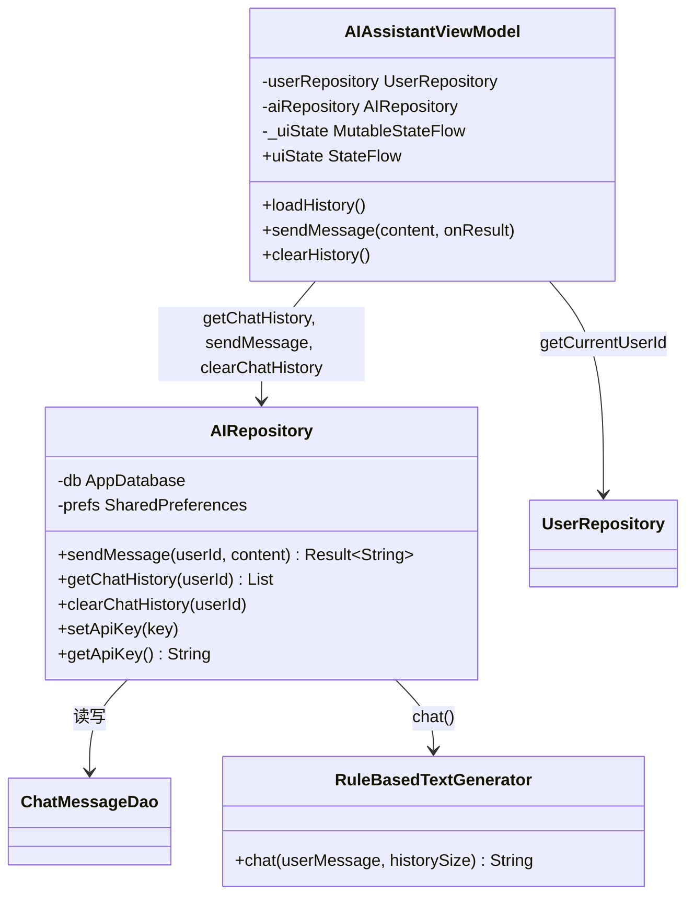

# 模块：AI 助手

## 1. 职责概述

AI 助手模块负责聊天消息的持久化与回复生成。当前采用 **规则回退**（RuleBasedTextGenerator），无 TFLite 模型时根据关键词返回固定回复；架构上可扩展为优先 TFLite、失败时规则回退（参考 aiAssistant 项目）。

## 2. 核心类

| 类/对象 | 职责 |
|--------|------|
| AIRepository | 聊天记录存取、调用 RuleBasedTextGenerator.chat、API Key 存储（预留） |
| RuleBasedTextGenerator | 根据用户消息关键词返回预设回复；无法匹配时返回通用提示（含 historySize） |
| AIAssistantViewModel | 加载历史、发送消息刷新列表、清空历史、错误状态 |
| AIAssistantScreen | 消息列表、输入框、发送与清空按钮，collect uiState |

## 3. 类图



## 4. 发送消息时序

```mermaid
sequenceDiagram
    participant User
    participant Screen
    participant VM as AIAssistantViewModel
    participant Repo as AIRepository
    participant DB as ChatMessageDao
    participant Rule as RuleBasedTextGenerator

    User->>Screen: 输入并发送
    Screen->>VM: sendMessage(content, onResult)
    VM->>VM: loading = true
    VM->>Repo: sendMessage(userId, content)
    Repo->>DB: insert(userMsg)
    Repo->>DB: getByUser(userId)
    Repo->>Rule: chat(content, historySize)
    Rule-->>Repo: reply
    Repo->>DB: insert(assistantMsg)
    Repo-->>VM: Result.success(reply)
    VM->>VM: loadHistory()
    VM->>VM: loading = false; onResult(reply)
    VM-->>Screen: uiState 更新
```

## 5. 规则回复逻辑（RuleBasedTextGenerator）

- 空消息 → "请输入你的问题哦～"
- 关键词匹配（不区分大小写）：你好/hello/hi、数学/算式/计算、总结/概括、谢谢 等 → 对应固定辅导话术。
- 未匹配 → 通用回复："我收到了：「…」。我这边是离线小助手…（对话数: N）"

## 6. 扩展点（TFLite）

- AIRepository.sendMessage 内可将「生成回复」抽象为接口：优先调用 TFLite 文本生成（参考 aiAssistant 的 TFLiteRunner / TFLiteTextGenerator），失败或未加载模型时再调用 RuleBasedTextGenerator.chat。
- 历史条数已受 AppConstants.MAX_HISTORY_MESSAGES 限制，便于作为 TFLite 上下文长度控制依据。
