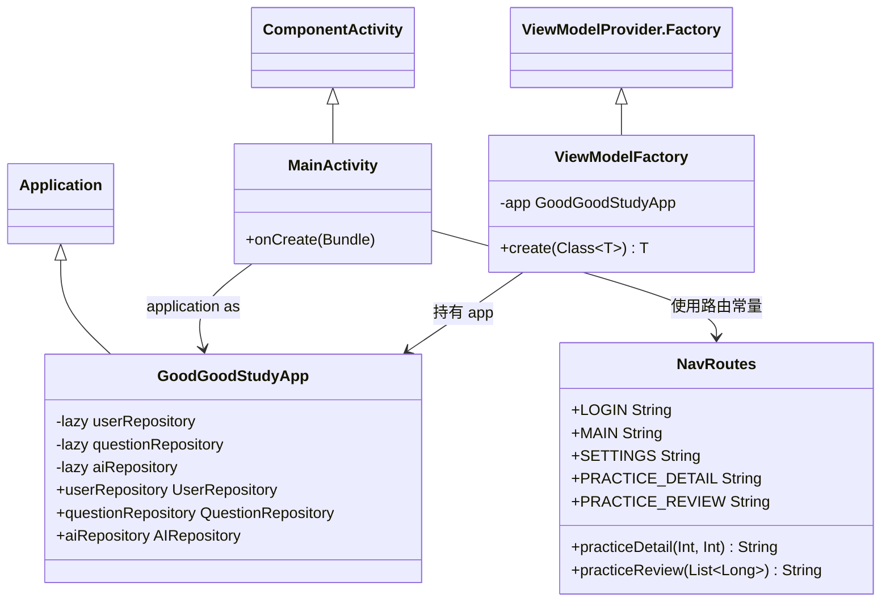
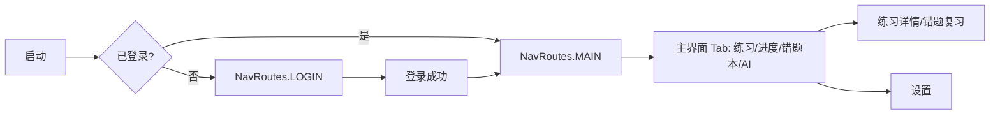

# 模块：应用入口与导航

## 1. 职责概述

本模块包含应用入口（Application、单 Activity）与全局导航配置，负责依赖提供、主题与路由注册，并根据登录状态决定起始界面。

## 2. 核心类列表

| 类/对象 | 所在包 | 职责 |
|--------|--------|------|
| GoodGoodStudyApp | com.edu.primary | Application 子类，懒加载提供 UserRepository、QuestionRepository、AIRepository |
| MainActivity | com.edu.primary | 单 Activity，setContent 中 NavHost 注册登录/主界面/设置/练习详情/错题复习路由 |
| NavRoutes | com.edu.primary.navigation | 路由常量与路径构造（practiceDetail、practiceReview） |
| ViewModelFactory | com.edu.primary.ui | 根据 ViewModel 类型从 App 注入 Repository 并创建 ViewModel |

## 3. 类图

## 4. 启动与路由流程

- 起始目的地：`if (app.userRepository.isLoggedIn()) NavRoutes.MAIN else NavRoutes.LOGIN`。
- 登录成功后：`navigate(MAIN)` 并 `popUpTo(LOGIN) { inclusive = true }`，避免 back 回到登录页。
- 练习详情与错题复习通过 NavArguments 传递 subjectId/grade 或 wrongIds 字符串（逗号分隔 Long）。

## 5. 与其它模块关系

- **ViewModel 层**：各 Screen 通过 `viewModel(factory = ViewModelFactory(app))` 获取 ViewModel，依赖本模块的 GoodGoodStudyApp 与 ViewModelFactory。
- **数据层**：不直接依赖 Repository，仅通过 App 间接持有；MainActivity 仅使用 `userRepository.isLoggedIn()` 做路由判断。
