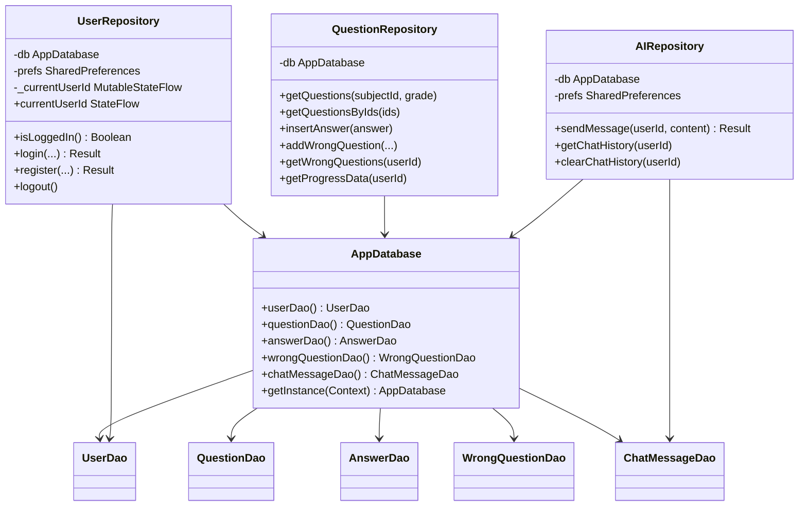
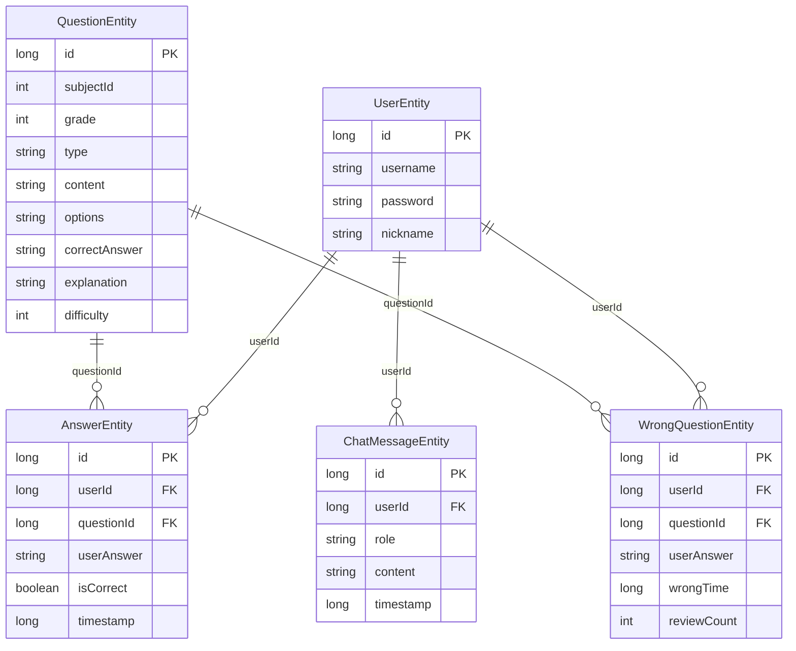

# 模块：数据层（Repository + Room + 实体）

## 1. 职责概述

数据层负责用户、题目、答题记录、错题、聊天消息的持久化与业务封装。Repository 在 IO 线程执行数据库与 SharedPreferences 操作，向 ViewModel 暴露 suspend 或 StateFlow 接口。

## 2. 核心类与接口

| 类型 | 类/接口 | 职责 |
|------|---------|------|
| 数据库 | AppDatabase | Room 单例，提供各 DAO，含 StringListConverter |
| DAO | UserDao, QuestionDao, AnswerDao, WrongQuestionDao, ChatMessageDao | 表级增删改查 |
| 实体 | UserEntity, QuestionEntity, AnswerEntity, WrongQuestionEntity, ChatMessageEntity | 表结构映射 |
| 仓库 | UserRepository, QuestionRepository, AIRepository | 业务聚合、校验、StateFlow（当前用户 ID） |
| 转换器 | StringListConverter | List&lt;String&gt; ↔ JSON，供 QuestionEntity.options |

## 3. 类图（简化）

## 4. 实体关系（ER 概念）

## 5. 关键流程

### 5.1 用户注册与登录（UserRepository）

- 注册：校验用户名/密码格式 → 查重 → 密码 MD5 加密 → insert UserEntity → 返回新 ID。
- 登录：按用户名查 UserEntity → 校验密码（支持明文兼容并自动升级为加密）→ 写入 SharedPreferences 并更新 `_currentUserId`。

### 5.2 练习与错题（QuestionRepository）

- 题目来源：按学科+年级查询；错题复习时按 ID 列表查询。
- 提交：插入 AnswerEntity；错题则 addWrongQuestion（有则 update）或 removeWrongQuestion / incrementReviewCount（复习模式）。

### 5.3 AI 聊天（AIRepository）

- sendMessage：插入用户消息 → 取最近 N 条历史 → 调用 RuleBasedTextGenerator.chat → 插入助手消息 → 返回回复文本。
- 历史与清空：getChatHistory(userId)、clearChatHistory(userId)。

## 6. 工具与初始化

- **StringListConverter**：Room TypeConverter，QuestionEntity 的 options 存为 JSON 字符串。
- **DatabaseInitializer**：若数学题表为空，则用 QuestionDataGenerator 生成各年级题目并插入；可与主界面 LaunchedEffect 配合在首屏调用。
