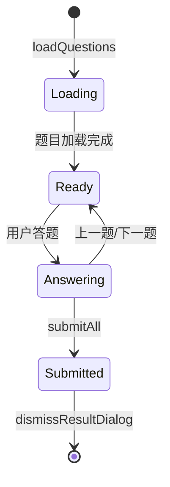
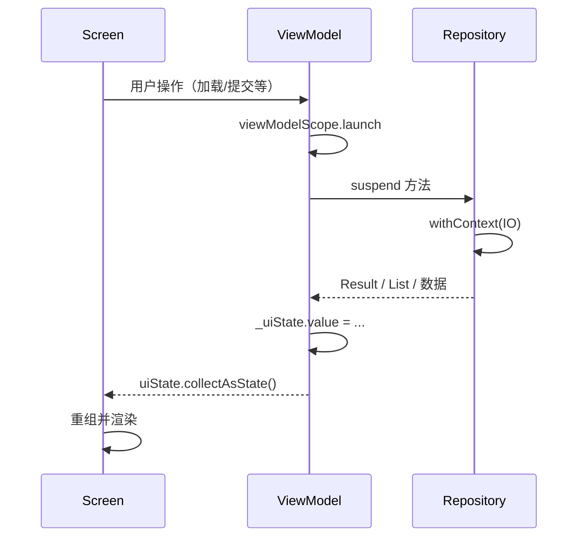

# 模块：练习与进度 UI（Compose + ViewModel）

## 1. 职责概述

本模块包含练习入口、练习详情（含错题复习）、进度统计、错题本四个功能对应的 Compose 界面与 ViewModel，以及登录、主界面、设置等通用 UI，状态由 StateFlow 驱动。

## 2. 核心类列表

| 界面/ViewModel | 职责 |
|----------------|------|
| LoginScreen / LoginViewModel | 登录、注册，成功后回调 onLoginSuccess |
| MainScreen | 底部 Tab：练习、进度、错题本、AI 助手；导航到练习详情/错题复习/设置 |
| PracticeScreen / PracticeViewModel | 学科/年级选择，加载题目数量，进入练习详情 |
| PracticeDetailScreen / PracticeDetailViewModel | 题目列表、当前索引、临时答案、提交判分、结果弹窗、错题记录 |
| ProgressScreen / ProgressViewModel | 展示总答题数、正确数、正确率 |
| WrongBookScreen / WrongBookViewModel | 错题列表，进入错题复习 |
| SettingsScreen | 设置页，返回与预留扩展（如 API Key） |
| AIAssistantScreen / AIAssistantViewModel | 聊天列表、发送消息、清空历史（见 module-ai） |

## 3. 练习详情状态与流程

- **PracticeDetailUiState**：questions, currentIndex, tempAnswers, allSubmitted, resultDialog 等。
- **提交逻辑**：遍历 questions，用 tempAnswers 取答案 → checkAnswer（单选/填空/判断题规则）→ insertAnswer、错题 addWrongQuestion 或 removeWrongQuestion / incrementReviewCount（复习模式）→ 弹出 ResultDialog。

## 4. 导航与参数

| 路由 | 参数 | 说明 |
|------|------|------|
| practice_detail/{subjectId}/{grade} | Int, Int | 普通练习，由 PracticeScreen 传入学科与年级 |
| practice_review/{wrongIds} | String | 错题 ID 逗号拼接，由 WrongBookScreen 传入 |

ViewModel 通过 ViewModelFactory 获取；PracticeDetailViewModel 需 subjectId、grade、wrongIds、isReviewMode，由 Screen 从 NavBackStackEntry 解析后传入。

## 5. 类关系（ViewModel 与 Repository）

## 6. 与数据层关系

- **PracticeViewModel**：QuestionRepository.getQuestionCount；UserRepository 用于后续扩展（如按用户过滤）。
- **PracticeDetailViewModel**：QuestionRepository.getQuestions / getQuestionsByIds、insertAnswer、addWrongQuestion、removeWrongQuestion、incrementReviewCount；UserRepository.getCurrentUserId。
- **ProgressViewModel**：QuestionRepository.getProgressData；UserRepository.getCurrentUserId。
- **WrongBookViewModel**：QuestionRepository.getWrongQuestions；UserRepository.getCurrentUserId。
