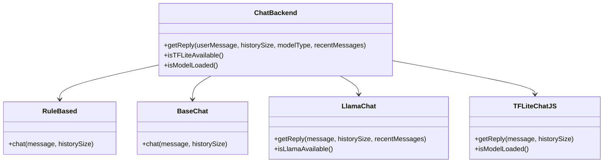
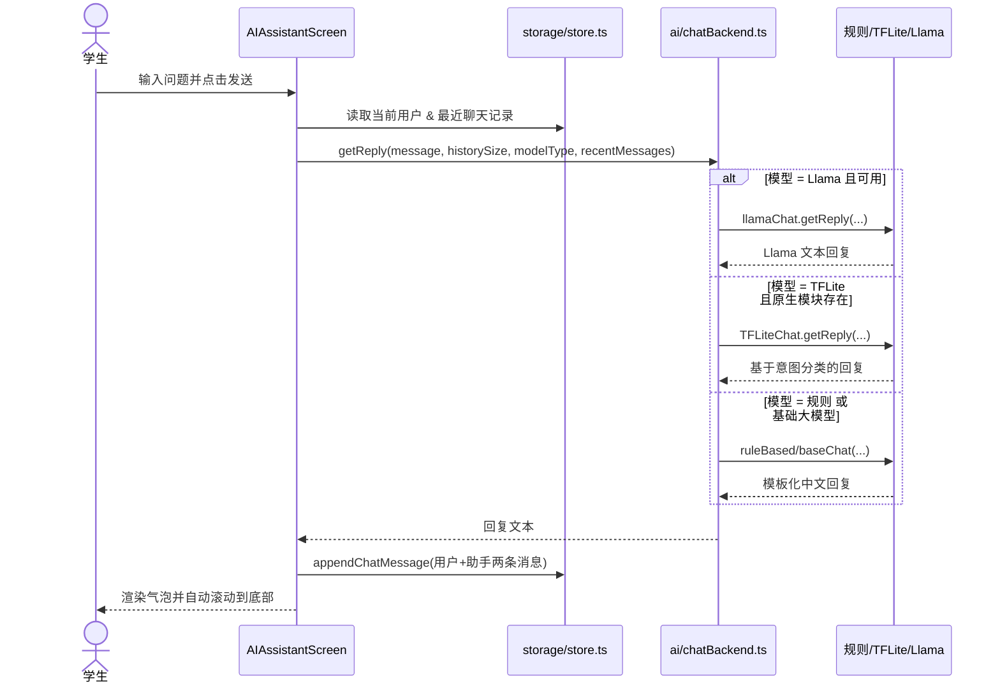
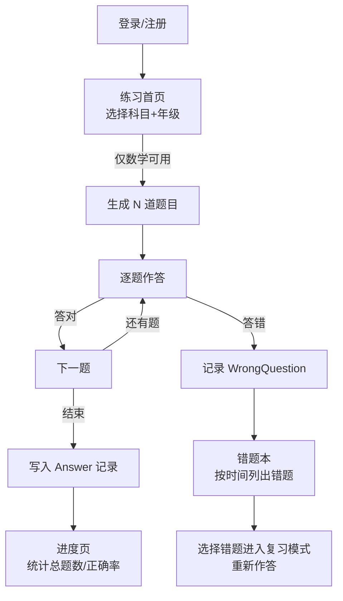

## 概览

`AndroidRN` 是一款面向小学生的课后练习与 AI 辅导 App，基于 **React Native 0.73 + TypeScript** 构建，采用：

- **前端层（UI 层）**：`src/screens` 下按业务分屏，入口为 `App.tsx` 的手写 Tab 导航。
- **业务与状态层**：轻量本地“仓库”封装在 `src/storage/store.ts`，统一管理用户、练习记录、错题与聊天记录。
- **AI 能力层**：`src/ai` 提供规则回复、基础模板大模型、TFLite 意图分类与 llama.cpp 端侧大模型封装。
- **持久化与文件层**：使用 `@react-native-async-storage/async-storage` 保存结构化业务数据，`react-native-fs` 管理 GGUF 模型下载。
- **原生扩展层**：Android 侧自定义 TFLite 原生模块与 `llama.rn`（JSI 模块）共同提供端侧 AI 推理能力。

整体是一个 **离线优先、本地存储驱动** 的小型学习系统。

---

## 分层架构图

```mermaid
graph TD
    subgraph UI层
      App[App.tsx\n手写 Tab 导航]
      Screens[各业务 Screen\nLogin / Practice / Progress / WrongBook / AI / Settings]
    end

    subgraph 业务&状态层
      Store[storage/store.ts\n本地仓库封装]
      ModelFiles[storage/modelFiles.ts\nLLM 模型文件管理]
      Types[types.ts\n领域模型类型]
    end

    subgraph AI层
      RuleBased[ai/ruleBased.ts\n规则回复]
      BaseChat[ai/baseChat.ts\n基础模板大模型]
      TFLiteJS[ai/tfliteChat.ts\nTFLite JS 封装]
      LlamaChat[ai/llamaChat.ts\nllama.rn 封装]
      ChatBackend[ai/chatBackend.ts\n统一对话路由]
      Catalog[ai/modelCatalog.ts\n模型元数据]
    end

    subgraph 持久化&文件层
      AsyncStorage["@react-native-async-storage/async-storage"]
      RNFS["react-native-fs\n(DocumentDirectoryPath)"]
    end

    subgraph 原生扩展层(Android)
      TFLiteModule[android/app/src/main/java/.../tflite\nTFLiteChatModule]
      LlamaRN[llama.rn\nJSI 模块]
      TFLiteDep[tensorflow-lite:2.14.0]
    end

    App --> Screens
    Screens --> Store
    Screens --> ChatBackend
    Screens --> ModelFiles

    Store --> AsyncStorage
    ModelFiles --> RNFS

    ChatBackend --> RuleBased
    ChatBackend --> BaseChat
    ChatBackend --> TFLiteJS
    ChatBackend --> LlamaChat

    TFLiteJS --> TFLiteModule
    LlamaChat --> LlamaRN
    TFLiteModule --> TFLiteDep
```

---

## 模块划分与职责

### 1. UI 层（`src/screens` + `App.tsx`）

- **`App.tsx`**
  - 负责应用整体 Shell：登录态判断、本地 Tab 导航（练习 / 进度 / 错题本 / AI 助手 / 设置）。
  - 在不同 Tab 间切换时，将简单参数（科目、年级、错题列表）透传给子 Screen。

- **`src/screens/LoginScreen.tsx`**
  - 登录 / 注册界面，使用 `encrypt()` 与校验工具对用户名、密码做基本校验和 MD5 加密。
  - 登陆成功后通过 `setCurrentUser` 写入当前用户 ID，并驱动 `App.tsx` 切换到主界面。

- **`src/screens/practice/PracticeScreen.tsx` & `PracticeDetailScreen.tsx`**
  - 练习配置与答题流程：
    - 选择科目（目前仅数学生效）与年级。
    - 调用题目生成工具 `utils/questionGenerator.ts` 创建一组数学题。
    - 收集用户作答，写入 `Answer` 记录，并将错误题目写入 `WrongQuestion`。

- **`src/screens/progress/ProgressScreen.tsx`**
  - 读取当前用户的所有 `Answer`，统计总答题数 / 正确数 / 正确率并展示概览。

- **`src/screens/wrongbook/WrongBookScreen.tsx`**
  - 展示当前用户所有错题，支持下拉刷新。
  - 点击某个错题可进入“复习模式”的 `PracticeDetailScreen`，按错题列表重做。

- **`src/screens/aiassistant/AIAssistantScreen.tsx`**
  - 聊天 UI：使用 `FlatList` + 悬浮“回到顶部”按钮。
  - 输入框优化了中文输入体验、键盘适配。
  - 内部根据设置中选择的模型类型，调用 `ai/chatBackend.getReply` 获取回复，并将聊天记录持久化到本地。

- **`src/screens/settings/SettingsScreen.tsx`**
  - AI 大模型选择：`基础大模型 / TFLite 意图 / 内置规则 / Llama（端侧）`。
  - 管理 Llama 模型路径，展示可下载的 GGUF 模型列表并调用 `downloadLLMModel` 下载到本地。

### 2. 存储与领域模型层（`src/types.ts` + `src/storage`）

- **`src/types.ts`**
  - 对齐原生 Android 工程的领域模型，定义：
    - `User / Question / Answer / WrongQuestion / ChatMessage / ProgressData` 等 TypeScript 接口。

- **`src/storage/store.ts`**
  - 以“内存缓存 + AsyncStorage”的方式实现简单仓库：
    - 启动时一次性加载全部用户 / 答题 / 错题 / 聊天 key 到内存。
    - 提供 CRUD 操作：新增用户、写入答题记录、维护错题集合、按用户拆分聊天记录等。
  - 使用 `KEY_CHAT_PREFIX` 将聊天按用户 ID 分桶，避免单个键过大。
  - 提供全局设置相关方法：`getAiModel / setAiModel / getLlamaModelPath` 等。

- **`src/storage/modelFiles.ts`**
  - 基于 `react-native-fs` 与 `AsyncStorage` 管理 GGUF 模型的下载与本地状态。
  - 通过 `listLLMModels` 将静态元数据（`ai/modelCatalog.ts`）与本地下载信息合并成统一视图。
  - 通过 `downloadLLMModel` 将远端 Gitee/HuggingFace 镜像下载到 `DocumentDirectoryPath/llm-models`。

---

## AI 模块与对话流程

### 模块关系图



### AI 对话时序图



### TFLite 与 llama.rn 集成

- **TFLite 意图分类**
  - Android 侧 `TFLiteChatModule.kt` 在应用启动时尝试从 `assets/intent_classifier.tflite` 拷贝模型至缓存并创建 `Interpreter`。
  - JS 通过 `NativeModules.TFLiteChat` 调用：
    - `getReply(text, historySize)`：将文本映射到关键词特征向量，送入 TFLite，得到 `greet/math/thanks/other` 四类意图，再生成固定回复。
    - `isModelLoaded()`：用于 UI 显示模型加载状态。

- **llama.rn 端侧大模型**
  - `ai/llamaChat.ts` 使用 `import('llama.rn')` 动态加载，并在内存中缓存 `completion` 上下文。
  - 模型路径由 `getLlamaModelPath` 提供，可为：
    - `file:///android_asset/models/xxx.gguf`（随 APK 打包的小模型）
    - `file:///data/.../files/llm-models/xxx.gguf`（运行时下载的模型）
  - 通过系统 Prompt 将模型约束为“小学课后辅导小助手”，支持结合最近若干轮对话做上下文续写。

---

## 练习 / 进度 / 错题本业务流程



---

## 第三方框架与库概览

更多细节见 `docs/third-party` 目录：

- **React / React Native**：核心 UI 框架与运行时。
- **@react-native-async-storage/async-storage**：本地 KV 存储，承载用户、答题、错题与聊天记录。
- **js-md5**：密码加密（教学场景下的简单 MD5，不适合生产级安全要求）。
- **llama.rn**：llama.cpp 的 React Native 绑定，支持 GGUF 端侧 LLM 推理。
- **react-native-fs**：读写沙箱文件系统，主要用于下载和保存 GGUF 模型文件。
- **TensorFlow Lite (org.tensorflow:tensorflow-lite:2.14.0)**：Android 侧意图分类模型推理。

---

## 开发与运行

- **环境要求**
  - Node.js ≥ 18
  - JDK 17
  - Android Studio（已安装 SDK 34+ 与对应 Build Tools）

- **主要脚本**（也列于根 `README.md`）
  - `npm start`：启动 Metro。
  - `npm run android:with-metro`：一条命令启动 Metro 并安装/运行 Android App。
  - `npm run android:clean`：清理 Android 构建（遇到构建或原生模块问题时使用）。

---

## 后续扩展建议

- 如需接入 **云端大模型**（如 DeepSeek 等），可在 `ai/chatBackend.ts` 增加新的分支，并在 `Settings` 中暴露对应选项与 API Key 配置。
- 如需更复杂的导航与动画，建议将当前手写 Tab + 状态，逐步迁移到 `@react-navigation/native` 的 Stack + Bottom Tabs 架构。
- 如需强化数据一致性，可将 `storage/store.ts` 抽象为“仓库 + 持久化层”，引入更健壮的离线优先策略（例如基于 SQLite 的本地数据库）。

