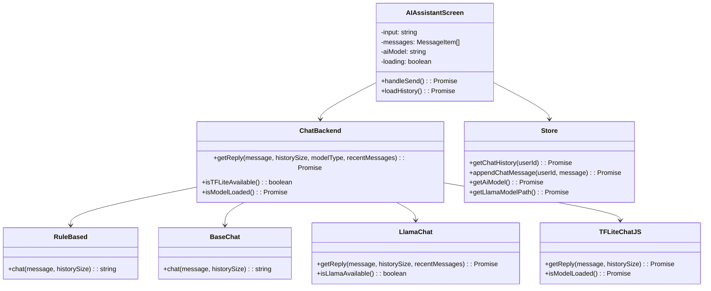
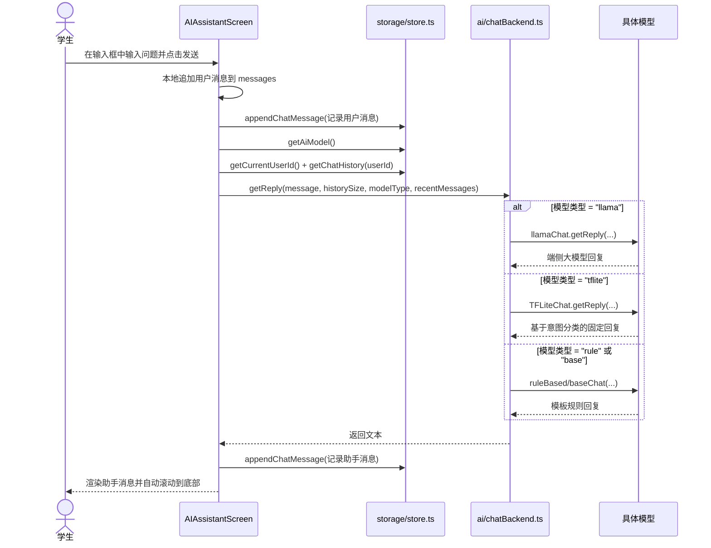

## module-ai-assistant：AI 助手模块

本模块负责“AI 助手”整条链路：从前端聊天 UI，到后端规则/TFLite/Llama 端侧推理，以及 LLM 模型管理与下载。

---

## 职责概述

- 提供聊天界面（消息列表、输入框、自动滚动、回到顶部按钮）。
- 统一封装对话后端：根据设置中选择的模型，路由到不同实现：
  - 内置规则回复。
  - 基础模板大模型（不依赖真实 LLM）。
  - TFLite 意图分类模型。
  - llama.rn + GGUF 端侧大模型。
- 管理 LLM 模型元数据与本地下载状态。
- 持久化聊天历史（按用户 ID 分桶）并在进入页面时恢复。

---

## 模块结构

- UI：
  - `src/screens/aiassistant/AIAssistantScreen.tsx`
- AI 后端：
  - `src/ai/chatBackend.ts`
  - `src/ai/ruleBased.ts`
  - `src/ai/baseChat.ts`
  - `src/ai/tfliteChat.ts`
  - `src/ai/llamaChat.ts`
  - `src/ai/modelCatalog.ts`
- 存储相关：
  - `src/storage/store.ts`（聊天记录、AI 模型类型、Llama 模型路径）
  - `src/storage/modelFiles.ts`（LLM 模型下载状态）

---

## 类图（核心关系）

---

## 业务流程（用户提问）

---

## 注意事项 / TODO

- 端侧 Llama 推理会占用较多内存与时间，前端已通过超时兜底回退到基础大模型；后续可根据设备性能动态调整超时时间与上下文窗口大小。
- 如果要接入云端大模型（如 DeepSeek），可以在 `chatBackend` 中新增分支，并在设置页增加对应模型选项与 API Key 配置。

