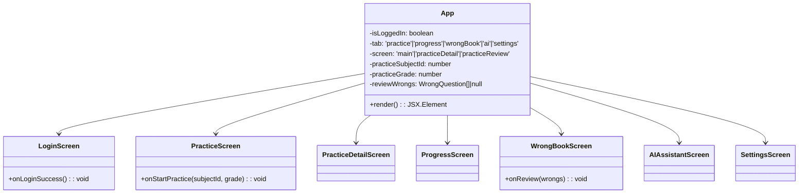
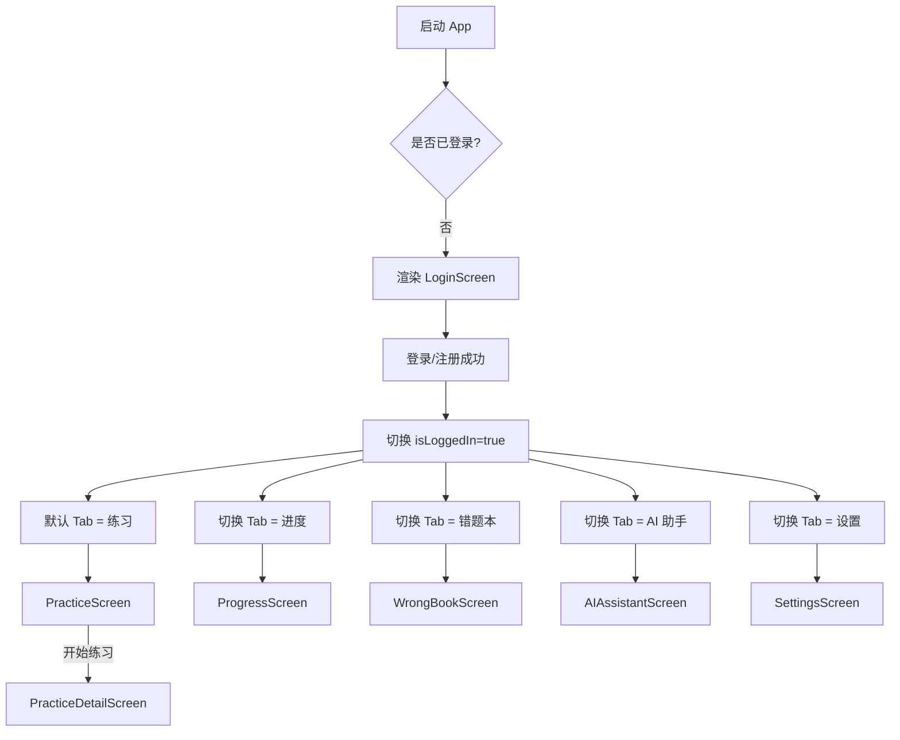

## module-app：应用壳与导航

本模块负责应用整体入口、登录流与底部 Tab 导航，是其它业务模块（练习、进度、错题本、AI 助手、设置）的“外壳”。

---

## 职责概述

- 管理应用生命周期的顶层组件 `App.tsx`。
- 处理**登录/注册**后的主界面切换。
- 提供简单的 **Tab 导航**（练习 / 进度 / 错题本 / AI 助手 / 设置）。
- 作为 Screen 之间的中介，传递练习参数、复习错题列表等。

---

## 核心文件

- `App.tsx`：应用入口组件，包含：
  - 登录态状态机（`isLoggedIn`）。
  - 当前 Tab 状态（`tab`）。
  - 练习详情 / 复习详情的子路由状态（`screen`）。

---

## 类图（简化）

---

## 主流程（登录 & 导航）

---

## 注意事项 / TODO

- 当前导航逻辑完全手写在 `App.tsx` 中，后续若业务变复杂，建议迁移到 `@react-navigation/native` 的 Stack + Bottom Tabs 架构。
- 登录态仅保存在内存状态（`isLoggedIn`），如需跨重启保持登录，需要结合 `storage/store.ts` 与安全存储方案（如 Keychain/Keystore）扩展。

