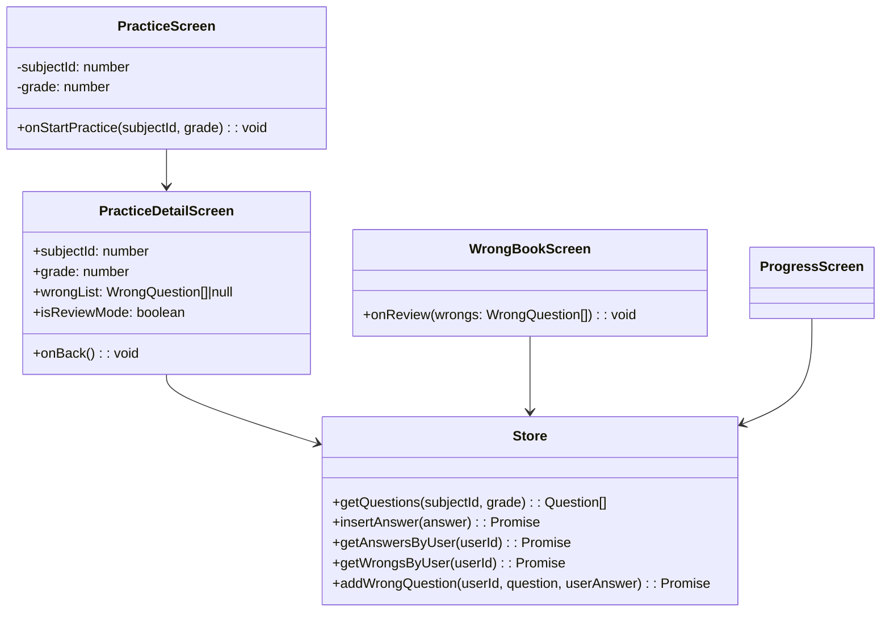

## module-practice：练习与错题本模块

本模块覆盖学生从“配置练习 → 做题 → 统计进度 → 复习错题”的完整闭环。

---

## 职责概述

- 配置并发起一次练习（科目 / 年级，目前仅数学可用）。
- 生成固定数量的数学题目并驱动答题流程。
- 将每次作答结果写入答题记录，统计全局进度。
- 将错误题目加入“错题本”，支持按题目复习。

---

## 模块结构

- UI：
  - `src/screens/practice/PracticeScreen.tsx`
  - `src/screens/practice/PracticeDetailScreen.tsx`
  - `src/screens/progress/ProgressScreen.tsx`
  - `src/screens/wrongbook/WrongBookScreen.tsx`
- 工具与类型：
  - `src/utils/questionGenerator.ts`
  - `src/types.ts` 中的 `Question / Answer / WrongQuestion / ProgressData`
- 存储：
  - `src/storage/store.ts` 中的答题与错题相关方法

---

## 类图（核心关系）



---

## 练习与错题业务流程

```mermaid
flowchart TD
    Start[学生进入练习 Tab] --> Select[选择科目+年级\n(当前仅数学可用)]
    Select -->|点击“开始练习”| Gen[生成题目列表\nquestionGenerator]
    Gen --> Answer[在 PracticeDetailScreen 逐题作答]

    Answer -->|答题提交| SaveAnswer[写入 Answer 记录]
    SaveAnswer --> Check{本题是否正确?}
    Check -->|是| Next[下一题]
    Check -->|否| AddWrong[写入 WrongQuestion]
    AddWrong --> Next

    Next -->|还有题| Answer
    Next -->|练习结束| Done[本次练习结束\n可在“进度”查看统计]

    Done --> Progress[进度页统计总答题数/正确率]
    AddWrong --> WrongBook[错题本列出所有错题]
    WrongBook --> Review[选择某道错题进入“复习模式”\n重新答题并更新记录]
```

---

## 注意事项 / TODO

- 当前题目生成逻辑在本地随机生成，如未来需要接入服务端题库，可在保持 `Question` 结构不变的前提下替换数据来源。
- 错题本目前按时间简单列出，后续可增加按知识点、年级等维度的筛选和统计。

